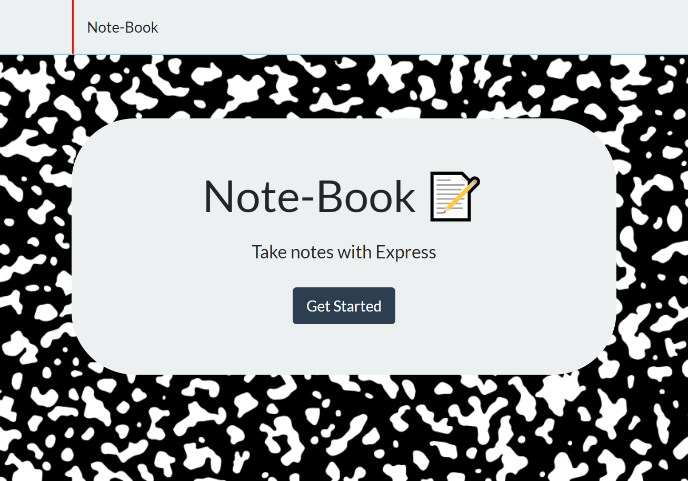
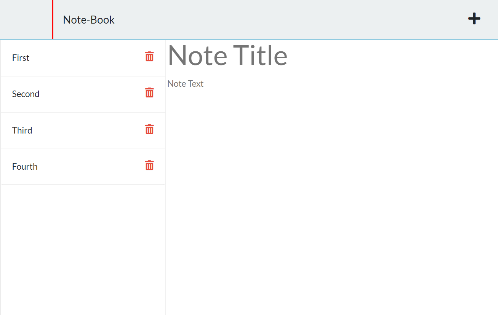

# Note-Book 

## Description

This project was created to assist the busy student or professional. Quickly jot down ideas or notes in this browser based note taker.

## 📚 Table of Contents 

- 🧾[Installation](#installation)
- 🛠️[Usage](#usage)
- 📇[License](#license)
- 👋[Contributing Guidlines](#contributing-guidlines)
- 📖[Test Instructions](#test-instructions)
- 👨‍🏫[Questions](#questions)

## Installation

To install this project you can clone or download the zip file. Install Node if you do not already have it. Then navigate to the root directory of the project in your terminal. Once there type 'npm install' and press enter. You are now all set to use the app!

## Usage

To begin navigate to the root directory of the project and type 'npm start' and press enter. Then go to http://localhost:3001/ to begin! Alternatively, go to  https://rocky-savannah-08577.herokuapp.com/ to check out the deployed site!

## License

This project is using the MIT license. For more information on this and other licenses please reference: [https://choosealicense.com/](https://choosealicense.com/).

## Contributing Guidlines

This project is using the [Contributor Covenant](https://www.contributor-covenant.org/) as a default. Please read over these guidlines before contributing
    
## Test Instructions

To test this app follow the instructions above. Open in VS code and play around with the code to learn about servers.

## Questions
Reach out via my [Github Profile](https://github.com/jonathanprill)
Or email me at test@gmail.com if you have any questions.